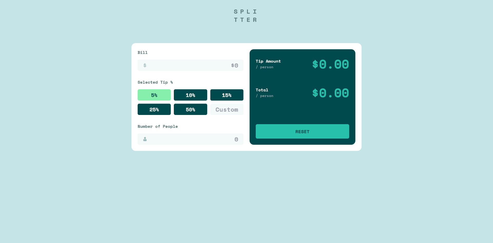
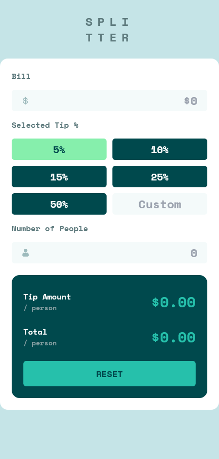

# Frontend Mentor - Age App Calculator solution

This is a solution to the [Age App Calculator on Frontend Mentor](https://www.frontendmentor.io/challenges/age-calculator-app-dF9DFFpj-Q). Frontend Mentor challenges help you improve your coding skills by building realistic projects.

## Table of contents

- [Overview](#overview)
  - [The challenge](#the-challenge)
  - [Screenshot](#screenshot)
  - [Links](#links)
- [My process](#my-process)
  - [Built with](#built-with)
- [Author](#author)

## Overview

### The challenge

Your users should be able to:

- View an age in years, months, and days after submitting a valid date through the form
  Receive validation errors if:

- Any field is empty when the form is submitted
- The day number is not between 1-31
- The month number is not between 1-12
- The year is in the future
- The date is invalid, e.g. 31/04/1991 (there are 30 days in April)

- View the optimal layout for the interface depending on their device's screen size
  See hover and focus states for all interactive elements on the page
  Bonus: See the age numbers animate t

### Screenshot

#### Desktop View

#### Mobile View

### Links

- Solution URL: (https://www.frontendmentor.io/challenges/age-calculator-app-dF9DFFpj-Q)
- Live Site URL: (https://age-calculator-app-topaz.vercel.app/)

## My process

### Built with

- Semantic HTML5 markup
- CSS custom properties
- Flexbox
- CSS Grid
- React JS
- Tailwindcss
- React Hook Form

## Author

- Linkedin - [Abdulaziz Shebani](https://www.linkedin.com/in/abdulazizshebani/)
- Frontend Mentor - [@ashebani](https://www.frontendmentor.io/profile/ashebani)
- Instagram - [@abdulaziz.shebani](https://www.instagram.com/abdulaziz.shebani/)
